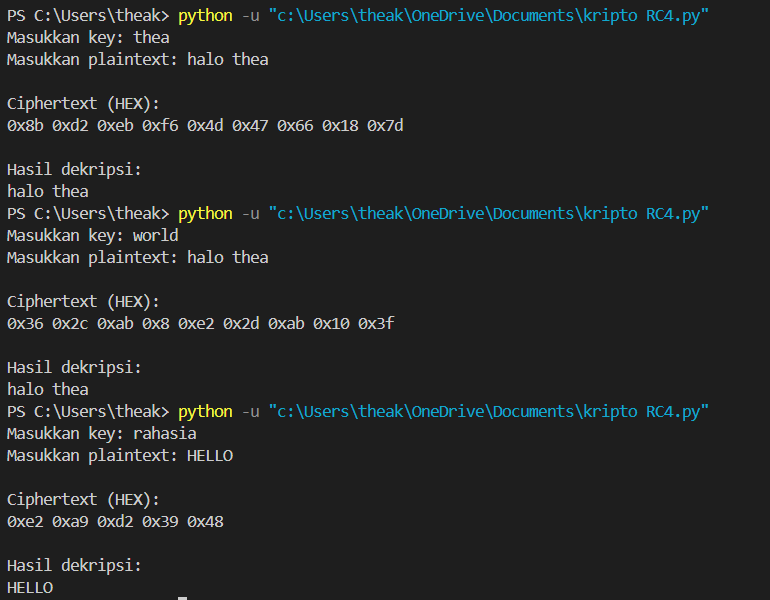

# Implemetasi-Kriptografi-RC4
RC4 encryption and decryption implementation in Python.
# RC4 Encryption Implementation

## Description
Program ini merupakan implementasi algoritma kriptografi RC4 menggunakan bahasa Python. Program ini dapat melakukan proses enkripsi dan dekripsi pesan menggunakan secret key yang dimasukkan oleh pengguna melalui terminal.

RC4 merupakan algoritma stream cipher yang bekerja dengan menghasilkan keystream pseudo-random yang kemudian digabungkan dengan plaintext menggunakan operasi XOR untuk menghasilkan ciphertext.

## Features
- Enkripsi plaintext menjadi ciphertext
- Dekripsi ciphertext kembali menjadi plaintext
- Menggunakan secret key dari pengguna
- Program dijalankan melalui terminal

## Requirements
Program ini membutuhkan:

Python 3.x

Tidak memerlukan library tambahan karena algoritma diimplementasikan secara manual.

## How to Run

1. Clone repository

```
git clone https://github.com/theakrisbiyantoro-hub/Implemetasi-Kriptografi-RC4
```

2. Masuk ke folder project

```
cd Implementasi-Kriptografi-RC4
```

3. Jalankan program

```
python rc4.py
```

## Example Output

```

```

## Algorithm
RC4 (Rivest Cipher 4)

## Author
Nama: Alethea Tsabita Calista Syawal
NIM: 24051204057
Kelas: TIB 24
